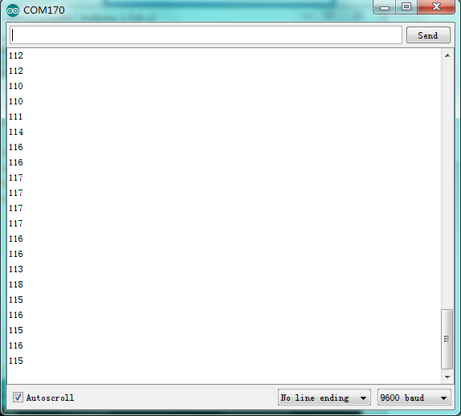

# Arduino


## 1. Arduino简介  

Arduino是一个开源电子原型平台，旨在简化电子项目的开发和编程。Arduino开发板通过集成的微控制器与各种传感器和执行器相结合，使开发者能够轻松创建互动和自动化项目。它具备简单易用的编程环境，用户可以使用C/C++语言进行编程，适合初学者和专业爱好者。Arduino在教育、艺术、科学和工程等多个领域得到了广泛应用，成为学习电子和编程的理想工具。  

## 2. 连接图  

  

## 3. 测试代码  

```cpp  
int sensorPin = A0; // 定义模拟口A0  
int value = 0; // 设置value为0  

void setup() {  
    Serial.begin(9600); // 设置波特率  
}  

void loop() {  
    value = analogRead(sensorPin); // 将value设置为读取到的A0的数值  
    Serial.println(value, DEC); // 显示value数值，并自动换行  
    delay(100); // 延迟0.1S  
}  
```  

## 4. 测试结果  

按照上图接线，烧录好程序，上电后，打开串行监视器，设置波特率为9600，即可看到代表当前光照强度的模拟值，如下图所示。  




