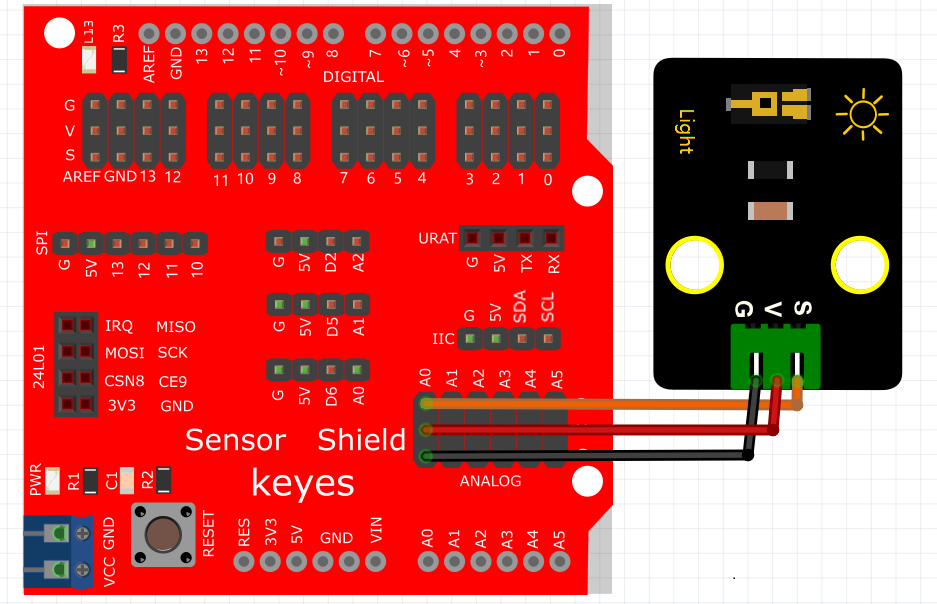
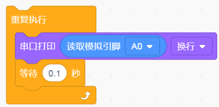
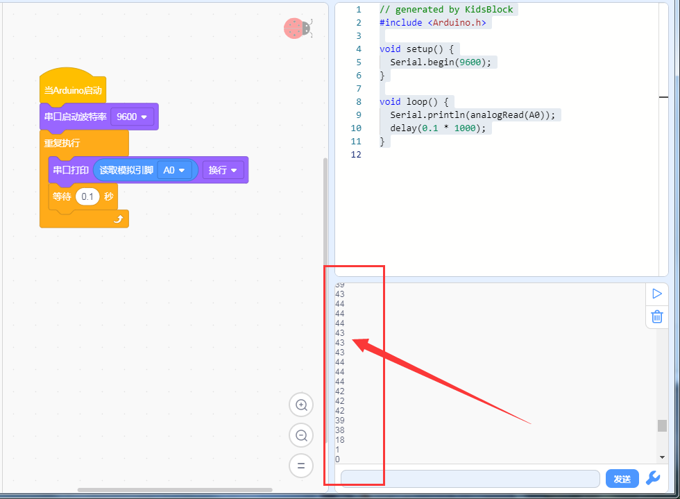

# KidsBlock

## 1. KidsBlock简介  

KidsBlock是一款图形化编程工具，特别设计用于帮助儿童和初学者轻松入门编程。它采用积木式的拖拽界面，用户可以通过简单的模块组合来构建程序，而不需要深入了解复杂的编程语言。KidsBlock支持与Arduino等硬件平台的集成，允许用户开发各种有趣的项目，如机器人、传感器应用等。该工具低门槛且互动性强，能够有效激发年轻学习者的创造力与兴趣，适合教育和自学。  

## 2. 连接图  

  

## 3. 测试代码  

1. 在事件里拖出Arduino启动模块。  

     

2. 在串口栏拖出设置串口波特率模块并设置波特率为9600。  

     

3. 在控制栏拖出重复执行模块。  

     

4. 在串口栏拖出串口打印模块；在引脚栏拖出读取模拟引脚模块设置引脚为A0并添加到串口打印模块上。  

     

5. 在控制栏拖出延时模块并设置延时为100ms。  

     

## 4. 测试结果  

按照上图接线，烧录好程序，上电后，打开窗口监视器，设置波特率为9600，即可看到代表当前光照强度的模拟值，如下图所示。  

