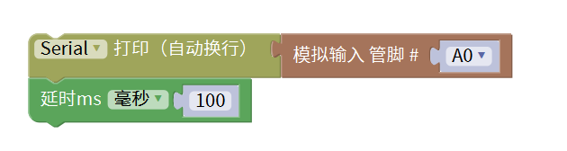
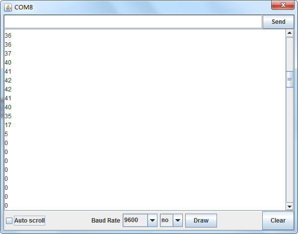

# Mixly

## 1. Mixly简介  

Mixly是一款开放源代码的图形化编程软件，旨在帮助初学者和儿童通过直观的积木式编程环境学习编程基础。它提供了丰富的模块，用户可以通过拖拽不同的积木组合来实现项目，而无需深入了解编程语法。Mixly特别适合与Arduino等硬件进行结合应用，用户可以轻松创建电子项目，并学习如何控制硬件设备。该工具通过趣味和互动性提高了学习编程的兴趣，并广泛应用于教育环境中。  

## 2. 连接图  

  

## 3. 测试代码  

  

## 4. 测试结果  

按照上图接线，烧录好程序，上电后，打开窗口监视器，设置波特率为9600，即可看到代表当前光照强度的模拟值，如下图所示。  

