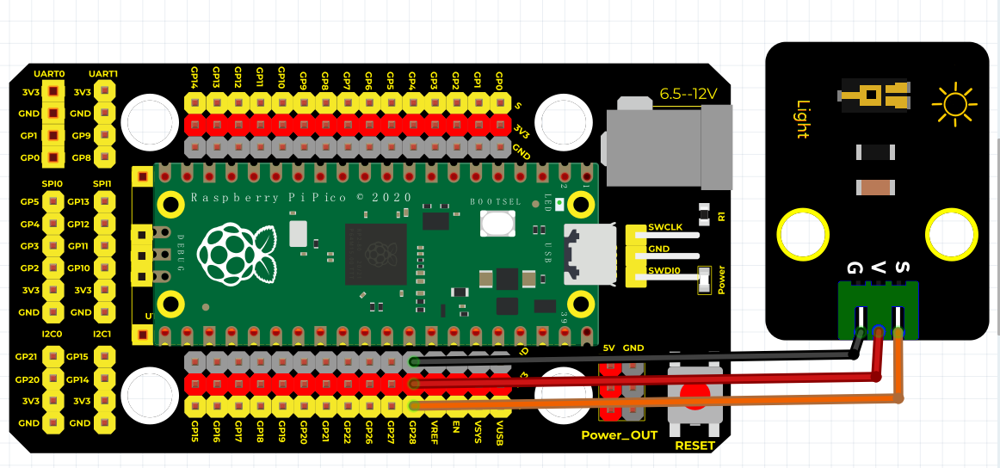
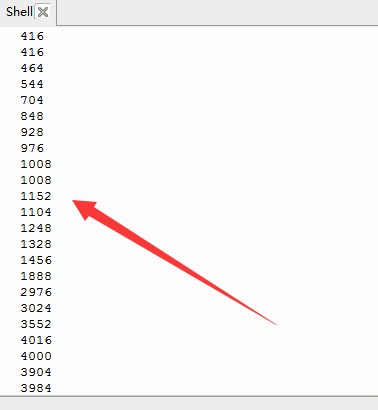

# Python


## 1. Python简介  

Python是一种高级编程语言，以其简单易读的语法和强大的功能受到广泛欢迎。它支持多种编程范式，包括面向对象、结构化和函数式编程，适合从初学者到专业开发人员的不同需求。Python拥有丰富的标准库和第三方模块，使得它在Web开发、数据分析、人工智能、科学计算等领域得到了广泛应用。其活跃的社区和高度的可扩展性，使得Python成为学习编程和开发应用程序的热门语言。  

## 2. 连接图  

  

## 3. 测试代码  

```python  
import machine  
import utime  

analogPin = machine.ADC(28)  # 设置28脚为模拟信号  

while True:  
    reading = analogPin.read_u16()  # 读取模拟信号  
    print(reading)  # 打印模拟值  
    utime.sleep_ms(100)  # 延迟100毫秒  
```  

## 4. 测试结果  

按照上图接线，烧录好程序，上电后，打开窗口监视器，设置波特率为9600，即可看到代表当前光照强度的模拟值，如下图所示。  




